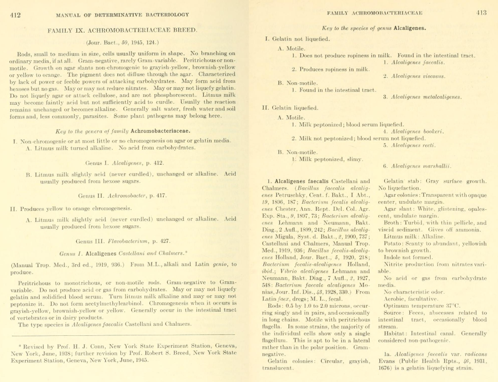
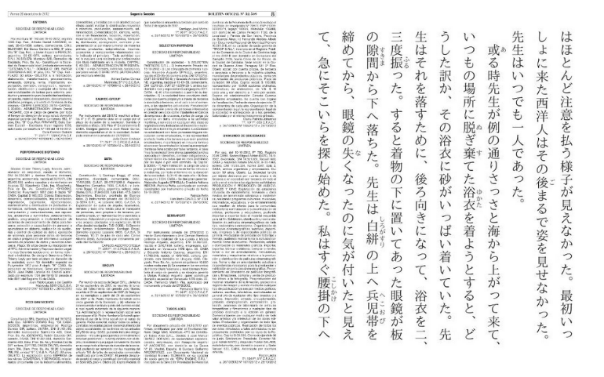

<em>pronounced zeen</em>

# DeepZine

Synthetic book pages made with deep learning. The thing that made [this Youtube video](https://www.youtube.com/watch?v=zH6guyxr0LI).

## Table of Contents
- [:book: About](#about)
- [:computer: Requirements](#requirements) 
- [:black_nib: Documentation](#documentation)
- [:squirrel: PAQ (Probably Asked Questions)](#paq)

## About

<em>Synthetic pages from DeepZine.</em>

This is a repository for a particular implementation of the Progressively Growing Generative Adversarial Network (PGGAN). This architecture was first developed by [Karras et al.](https://github.com/tkarras/progressive_growing_of_gans) in ["Progressive Growing of GANs for Improved Quality, Stability, and Variation"](https://arxiv.org/abs/1710.10196). The code that this repository was based on was developed by the Github user zhangqianhui's [Tensorflow implementation](https://github.com/zhangqianhui/progressive_growing_of_gans_tensorflow) of the PGGAN, although some significant changes have been made since.

While the classic implementations of the PGGAN so far have been to make high-resolution, realistic [faces, objects](https://www.youtube.com/watch?v=XOxxPcy5Gr4), and [memes](https://twitter.com/goodfellow_ian/status/937406530743287808), this implementation generates syntehtic book pages! It does this by downloading a set number of print pages from the Internet Archive using their Python API, preprocessing them into images of a regular square shape, and then feeding them into the original PGGAN architecture. You can read documentation on how to do all of that below.

   
    <em>Real pages from the <a href="https://archive.org/details/MBLWHOI">MBL-WHOI Collection.</a></em>

This project was developed as a sort of toy dataset for other work on [synthesizing high-resolution medical images](https://arxiv.org/abs/1805.03144) using the PGGAN. One of the things I noticed while training medical image PGGANs was that some repetitive overlaid clinical annotations were reproduced letter-for-letter in the synthesized images. I wanted to see what the PGGAN would do on a dataset of purely text. I downloaded archived scientific reports from the [Woods Hole Oceanographic Institute](https://archive.org/details/MBLWHOI), and found the result to be fascinating. Instead of English letters, there were dreamlike pseudo-letters, arranged in fake paragraphs, in fake columns, with fake headers and fake page numbers. Cover pages, tables, and figures swirled together into abstract ink blot pages when there was no text to generate. It was mesmerizing, and I think worth sharing :).

## Requirements

1. Different parts of this pipeline require different packages. If all you want to do is download data from the Internet Archive, you only need install packages in the requirements.txt file using the following command: 

    `pip install -r requirements.txt`

2. If you download data from the Internet Archive, you will need to authenticate with an Internet Archive account. You can find more details about that at [this documentation link](https://archive.org/services/docs/api/internetarchive/quickstart.html#configuring). You will also need to be able to use one of two packages for converting images to PDF. On Windows, you can use [Ghostscript](https://www.ghostscript.com/download/gsdnld.html); on Linux, you can use [pdftoppm](https://linux.die.net/man/1/pdftoppm). You can set which one you want to use in this repo's config.yaml file.

3. If you want to actually train a neural network with a GPU, you will need to install Tensorflow with GPU support. This can be a doozy if you're doing it for the first time &mdash; this [link from Tensorflow](https://www.tensorflow.org/install/gpu) will get you started, and there's always StackOverflow if you need more help :)

4. You probably won't need the last requirement, but I will include for the sake of completeness. If you want to make a video out of the latent space interpolations, you have a few options. In this Github page, I use a wrapper around [ffmpeg](https://www.ffmpeg.org/). You can use the _export_movie.py_ script to create a video out of interpolated images, or see a guide using ffmpeg directly at this [link](http://hamelot.io/visualization/using-ffmpeg-to-convert-a-set-of-images-into-a-video/).

## Documentation / Instructions

The easiest way to run your own model is by filling out the config.yaml file. On the config.yaml file, you can run four principal actions:

* `load_data` - Use the Internet Archive API to bulk download PDFs from a certain Internet Archive collection, convert them into square images, and then save them into one big, preprocessed HDF5 file for efficient loading. 
* `train` - Train a PGGAN model on a HDF5 file created in the previous step. The PGGAN trains in stages. It starts generating images at 4x4 pixels, and doubles resolution every step. Each step has two parts: and "interpolation" stage, where it is generating images interpolated halfway between, for example, 4x4 pixels and 8x8 pixels, and a steady-state stage where it is only training on 8x8 images. It will train until a final resolution that you specify.
* `inference` - You can sample random latent vectors from a trained model using this process, and output them to a folder.
* `interpolation` - Save out images at regular intervals while interpolating between a series of random latent vector. Creates stunning "GAN animations" that you may have seen before. 

To run, for example, the load_data part of the pipeline, just set the `load_data` parameter to True. Each part of the pipeline has many sub-parameters you can set to customize the whole process. Once you have finished filling out your chosen config file, simply run:
    
    python wrapper.py config.yaml

One thing to note is that when loading an old model, you need to make sure that the parameters in the "Model Parameters" section of the config file are the same as when you trained that model. Otherwise, Tensorflow will get mad :'(.

Pretrained models at resolutions 4 through 1024 can be found in the pretrained_models folder. If you want to run inference on these models, you can use the config file included in this repository titled "config_pretrained.yaml". These pretrained models were trained onf 50,000+ pages from 100+ documents in the [Woods Hole Oceanographic Institute](https://archive.org/details/MBLWHOI) collection on Internet Archive. Be sure to turn the

    pretrained: True

flag on when using these pretrained models, as they were created earlier in
the year with a slightly different architecture than the one provided here.

If you don't want to use the config.yaml file, I have tried to document the rest of the code. Play around with it if you want, and create a Github issue if something doesn't work!

## PAQ (Probably Asked Questions)

### Why not use Tero Karras' own Tensorflow implementation?

Much of this code was first written back in January/February of 2018. Back then, Karras' implementation was only in Theano, and I'm wedded to Tensorflow. This is probably why zhangqianhui made a Tensorflow version in the first place, from which this repository is based.

There's no question that Karras' implementation of the PGGAN is the best one out there, and will let you download all sorts of datasets and run all sorts of baselines. You should treat their code as a gold standard if you're looking to do any further experiments with the PGGAN.

### What sort of GPU hardware do you need to run to get this running (and for how long)?

It depends on how you parameterize the PGGAN. If you lower the max_filter parameter in model.py, run the model with a reduced batch size, or adjust the "Model Size Throttling Parameters", you can run a lightweight version of the PGGAN. You might not get as good results. Somewhat disconcertingly, [Google just showed](https://arxiv.org/pdf/1809.11096.pdf) that in the state of the art, the key to getting super-realistic GANs is to, well, increase the batch size and the number of parameters in your model..

This being said, I originally trained this model on a [P100](https://www.nvidia.com/en-us/data-center/tesla-p100/), which may be out of the price range for most casual users (and for myself, for that matter, given how precious GPU time is these days). It took about two days to train this model to completion. My final 1024x1024 layers only had 16 filters per convolution at a batch size of 4, so likely not too much is going on in those layers. I would be interested to see how big we can get the PGGAN, or really _any_ GAN, to go on lower-level GPU hardware, but that's an experiment for another day.

### Help, my GAN training collapsed!

¯\\_(ツ)_/¯

It happens. GANs have notably had a problem with training collapse. This means
that loss functions go out of control, and your images start looking awful. While there may be solutions out there in the literature, I haven't implemented any here. You'll have to simply retrain your network, most likely :(. Drop me a note if you've found a way around this, or have found a bug in my code that causes it to happen.

### What's up with the different methods of interpolation?

As documented most thoroughly in [this GitHub issues page](https://github.com/soumith/dcgan.torch/issues/14), "spherical interpolation" is preferred to linear interpolation when sampling from the latent space of GANs. The brief explanation is that interpolating in a straight line between two points ("linear interpolation") traverses through sections of the latent space that are extremely improbable to be selected during training, and thus not constrained to appear as "real" images. This means that linear interpolation will likely traverse through non-realistic portions of the space. Spherical interpolation, which travels on great circles on the hypersphere, is more likely to stay in areas of the latent space likely to be sampled.

Perhaps, however, you are interested in those strange areas of the latent space that are not very well-conditioned. Fortunately for you, I added a third option for interpolation: origin interpolation. This will interpolate linearly, but making a pitstop at the origin of the latent space. The origin, having a vector magnitude of zero, is extremely unlikely to appear during training, and thus is likely to create some strange looking images along the way.

### What's up with that _add\_parameter_ function??

I find it more pleasant to read than Python's default implementation of class variables :).

### Why make this repository?

I think there are a lot of other collections on the Internet Archive that one could make some great visualizations out of. Two that. Unfortunately, I don't really have the capacity to make them. But at least I can give you the code, so that maybe you can take a stab at it. Here are two collections that I think might make good starts: [the Blue Sky Library](https://archive.org/details/aozorabunko) and [El Boletin Oficial de la Republica Argentina](https://archive.org/details/boletinoficialdelarepublicaargentina).

   
    <em>Other datasets I would like to create GANs for. Or maybe, one GAN to rule them all?</em>

I also wanted a chance to make a well-documented repository in deep learning, with variable names that were more than one letter long. I also have not seen too many deep learning repos that include code not only for implementing a neural network, but also for gathering and preprocessing data using APIs and external packages. Hopefully, this project can serve as an example for other people's projects.

### Why _really_ make this repository?

[link](http://anderff.com/resources/ABeers_Resume.pdf)
